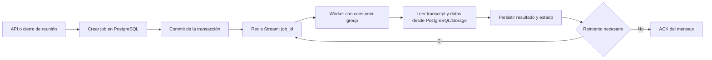

# Redis en AdVera

Redis se utiliza en AdVera como transporte de trabajos asíncronos mediante **Redis Streams**. Permite desacoplar la API de los workers y ejecutar procesamiento derivado sin bloquear la sesión de audio ni las peticiones HTTP.

Redis no es la fuente de verdad de los jobs. PostgreSQL conserva el estado, los intentos, los leases, los errores y los resultados. Si Redis o un worker se detienen, los jobs persistidos pueden recuperarse y volver a encolarse.

## Flujo general



El mensaje enviado a Redis es pequeño y contiene únicamente el identificador del job:

```text
{ "job_id": "<id del job>" }
```

El worker vuelve a validar el transcript, el hash de entrada y el estado persistido antes de procesar. Esto evita usar datos obsoletos o un transcript que haya cambiado después de crear el job.

## Streams configurados

Los nombres se pueden cambiar mediante configuración, pero estos son los valores por defecto definidos en `backend/app/config.py`.

| Stream | Job | Worker | Propósito |
| --- | --- | --- | --- |
| `advera:transcription:jobs` | `TranscriptionJob` | Transcription worker | Ejecutar la transcripción definitiva desde los tracks PCM almacenados. |
| `advera:brain:jobs` | `BrainJob` | Brain worker | Extraer resumen, temas, decisiones, acciones, preguntas, riesgos, conceptos y relaciones desde el transcript definitivo. |
| `advera:memory:index` | `MemoryIndexJob` | Memory worker | Crear chunks, generar embeddings BGE-M3, guardar evidencias y proyectar el grafo de memoria. |
| `advera:memory:query` | `MemoryQueryRun` | Memory worker | Ejecutar búsquedas híbridas de memoria y generar respuestas con evidencias. |

Cada stream tiene su propio consumer group. Los workers leen con `XREADGROUP` y confirman el mensaje con `XACK` después de intentar procesarlo. Los tres workers comparten el mismo bucle de consumo (`backend/app/consumer.py`): si Redis o PostgreSQL dejan de responder, el worker espera unos segundos y sigue, sin terminar el proceso; el trabajo interrumpido conserva su lease y lo recupera la reconciliación contra PostgreSQL.

## 1. Transcripción definitiva

Al cerrar una reunión, el backend persiste un `TranscriptionJob` en PostgreSQL y publica su `job_id` en `advera:transcription:jobs`. El WebSocket no espera a MOSS ni a WhisperX: devuelve `audio.stopped` y `transcript.queued`, y el worker continúa con los tracks PCM compartidos.

El worker ejecuta MOSS o el proveedor definitivo configurado, usa WhisperX como fallback explícito cuando corresponde, escribe `transcript.json` de forma atómica y marca la reunión como `ready`. Solo después de confirmar ese commit crea y encola Brain y Memory. El estado durable se consulta en `/api/meetings/{meeting_id}/transcription`; los eventos WebSocket de progreso son una optimización de entrega, no la fuente de verdad.

Implementación: [transcription_jobs.py](../backend/app/transcription_jobs.py), [transcription_worker.py](../backend/app/transcription_worker.py), [audio.py](../backend/app/audio.py) y [meetings.py](../backend/app/meetings.py).

## 2. Brain

El job de Brain se crea cuando existe un `TranscriptDocument` definitivo y se ha guardado correctamente. El transcript definitivo es la única entrada válida para inteligencia.

El flujo es:

1. Se guarda atómicamente `transcript.json`.
2. Se crea o reutiliza un `BrainJob` idempotente en PostgreSQL.
3. Se confirma la transacción.
4. Se publica el `job_id` en `advera:brain:jobs`.
5. El Brain worker reclama el job y cambia su estado a `running`.
6. El worker ejecuta el proveedor LLM y valida la salida estructurada.
7. Se persisten `LLMRun` y `BrainExtraction`.
8. El job pasa a `completed` o a `queued`/`failed` según el resultado.

La clave de idempotencia se basa en la reunión, el hash del transcript, el proveedor, el modelo y la versión del prompt. Por ello, repetir la solicitud no debería crear trabajos duplicados para la misma entrada.

Implementación: [brain_jobs.py](../backend/app/brain_jobs.py), [brain_api.py](../backend/app/brain_api.py) y [worker.py](../backend/app/worker.py).

## 3. Indexación de Memory

La indexación de Memory se encola después de persistir el transcript definitivo, junto al job de Brain. Los chunks, embeddings y evidencias salen solo del transcript, así que no esperan a Brain. La proyección de conceptos y relaciones, que sí necesita la extracción de Brain, es un job de indexación aparte (`kind = concepts`) que crea el worker de Brain al completar su extracción y publica en este mismo stream (ver [ADR 0019](adr/0019-brain-concept-extraction-and-graph-projection.md)).

El worker realiza estas operaciones:

1. Valida que el transcript sea definitivo y que su hash coincida.
2. Divide el transcript en chunks con referencias a sus segmentos.
3. Genera embeddings, normalmente con BGE-M3.
4. Persiste chunks y evidencias en PostgreSQL/pgvector.
5. Proyecta entidades, relaciones, conceptos y ocurrencias con su evidencia.
6. Marca el job como `completed`.

El job de indexación de chunks no depende de Brain y no hay espera ni reencolado por esa causa. El job de conceptos se crea cuando Brain termina, así que tampoco espera: no hace falta el contrato de espera de `memory-index-queue-hot-loop.md`. Si se regenera la extracción, el job antiguo termina con `STALE_EXTRACTION` (sin reintento) y el nuevo proyecta la extracción vigente.

Implementación: [memory_jobs.py](../backend/app/memory_jobs.py), [audio.py](../backend/app/audio.py), [worker.py](../backend/app/worker.py) y [memory_worker.py](../backend/app/memory_worker.py).

## 4. Consultas de Memory

Cuando el usuario ejecuta una búsqueda global, la API:

1. Crea un `MemoryQueryRun` con estado `queued`.
2. Confirma el registro en PostgreSQL.
3. Publica el identificador en `advera:memory:query`.
4. Devuelve al cliente el estado `queued`.
5. El Memory worker recupera contexto mediante búsqueda full-text y vectorial.
6. Si está configurado, ejecuta la síntesis LLM.
7. Guarda la respuesta, las citas y el estado final.

Los estados de una consulta pueden incluir `queued`, `retrieving`, `synthesizing`, `completed`, `empty` y `failed`. Si Redis no está disponible al crear la consulta, la API deja el registro en estado `failed` con un error explícito, en lugar de ocultar el problema como una consulta eternamente pendiente.

Implementación: [memory_api.py](../backend/app/memory_api.py), [memory_jobs.py](../backend/app/memory_jobs.py) y [memory_worker.py](../backend/app/memory_worker.py).

## Reintentos y recuperación

Los workers mantienen el estado del job en PostgreSQL y usan leases para evitar que dos consumidores procesen simultáneamente el mismo trabajo.

- Un job nuevo comienza en `queued`.
- Al ser reclamado pasa a `running` o a `retrieving`/`synthesizing` en el caso de una consulta.
- Un error recuperable devuelve el job a `queued` y publica de nuevo su `job_id` en el stream.
- Al superar el máximo de intentos pasa a `failed`.
- Un lease antiguo se considera stale y puede recuperarse al reiniciar o reconciliar el worker.
- Los workers también buscan periódicamente jobs persistidos en estado `queued` para volver a publicarlos si se perdió el mensaje de Redis.

Los límites por defecto son tres intentos para Brain y para la indexación de Memory. La consulta usa el timeout configurado para detectar leases antiguos.

## Qué no se encola en Redis

No se encola un job separado por pista de audio. El job único de transcripción definitiva se guarda en PostgreSQL y su identificador se publica en `advera:transcription:jobs`; el worker procesa por separado cada pista PCM disponible.

La transcripción provisional y la captura de audio usan buffers `asyncio.Queue` internos y WebSockets. Esas colas en memoria no sustituyen a los Redis Streams de jobs.

El flujo completo, incluyendo el límite entre transcript provisional y transcript definitivo, está documentado en [Meeting Processing Flow](meeting-processing-flow.md).

## Configuración

La configuración principal está en `backend/app/config.py`:

```text
TRANSCRIPTION_QUEUE_NAME=advera:transcription:jobs
REDIS_URL=redis://localhost:6379/0
BRAIN_QUEUE_NAME=advera:brain:jobs
MEMORY_INDEX_QUEUE_NAME=advera:memory:index
MEMORY_QUERY_QUEUE_NAME=advera:memory:query
```

Los nombres se exponen como settings de la aplicación, no deben codificarse en los workers. En Docker Compose, Redis debe estar disponible antes de iniciar los workers.

## Operación y diagnóstico

La página Monitor muestra estas cuatro streams en modo solo lectura. Para cada una presenta su longitud, grupos de consumidores, pendientes y una muestra máxima de ocho entradas con únicamente el `job_id`, el ID de Redis y la hora derivada del ID. Cuando el job tiene un fallo persistido, muestra debajo un código seguro como `JOB_FAILED` o `JOB_REQUEUED`, nunca el mensaje crudo del proveedor. Redis sigue siendo transporte: el estado durable del job debe consultarse en PostgreSQL.

Si Redis no responde, cada cola aparece como no disponible y el resto del Monitor continúa operativo. La API no devuelve el cuerpo completo de los mensajes ni contenido de reuniones.

Para comprobar la existencia de un consumer group y observar su estado, se pueden usar comandos de Redis como:

```text
redis-cli XINFO GROUPS advera:transcription:jobs
redis-cli XLEN advera:transcription:jobs
redis-cli XINFO GROUPS advera:brain:jobs
redis-cli XLEN advera:brain:jobs
redis-cli XINFO GROUPS advera:memory:index
redis-cli XINFO GROUPS advera:memory:query
```

Los diagnósticos no deben imprimir tokens, audio, transcripts completos ni contenido real de reuniones. Para investigar un job, usar su `job_id` y consultar el registro correspondiente en PostgreSQL.

## Límites de diseño

- Redis transporta identificadores y coordinación; PostgreSQL y el almacenamiento de reuniones contienen los datos duraderos.
- Brain y Memory son colas independientes para aislar fallos y permitir su recuperación por separado.
- La indexación nunca debe consumir un transcript provisional.
- Un fallo de Redis no debe borrar el transcript definitivo ni el audio original.
- Las modificaciones de streams, workers, estados, contratos o límites de recuperación deben mantenerse sincronizadas con [Meeting Processing Flow](meeting-processing-flow.md) y, si cambian una frontera arquitectónica, con el ADR correspondiente.
